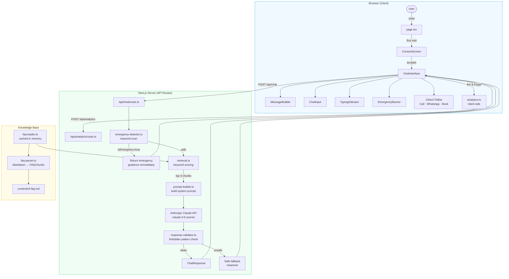

# IVF Assistant Chatbot — Dr. Mekhala's Clinic

A mobile-first IVF education chatbot built with Next.js 14, TypeScript, Tailwind CSS, and the Anthropic Claude API.

## Architecture



### Request flow

1. **Consent gate** — user must accept the disclaimer before the chat loads (stored in `sessionStorage`)
2. **Emergency detection** — every message is scanned for ~25 crisis keywords *before* the LLM is called; a match returns an immediate escalation response
3. **Retrieval** — keyword + token scoring ranks FAQ chunks and selects the top 3 most relevant
4. **Prompt building** — a fixed system prompt (persona, guardrails, tone) is combined with the retrieved chunks as context
5. **Claude API** — conversation history (capped at 20 messages) is sent to Claude with a 1024-token output limit
6. **Response validation** — Claude's output is checked for forbidden patterns (dosage advice, diagnostic language, lab interpretation); unsafe responses are replaced with a safe fallback

---

## Setup

1. Clone the repository
2. Install dependencies: `npm install`
3. Copy `.env.example` to `.env.local` and fill in your values
4. Run development server: `npm run dev`

## Environment Variables

| Variable | Description |
|---|---|
| `ANTHROPIC_API_KEY` | Your Anthropic API key (server-side only) |
| `CLAUDE_MODEL` | Claude model to use (e.g. `claude-3-5-sonnet-20241022`) |
| `NEXT_PUBLIC_CLINIC_PHONE` | Clinic phone number for `tel:` links |
| `NEXT_PUBLIC_CLINIC_WHATSAPP` | WhatsApp number for `wa.me/` links (digits only) |
| `NEXT_PUBLIC_BOOKING_URL` | URL for the booking page |

## Deployment (Vercel)

1. Push code to GitHub
2. Connect the repository to a new Vercel project
3. Set all environment variables in the Vercel dashboard
4. Deploy — Vercel auto-detects Next.js

## Running Tests

```bash
npm test
```

## Knowledge Base

Update `/content/ivf-faq.md` to modify the chatbot's knowledge base. No code changes required.
