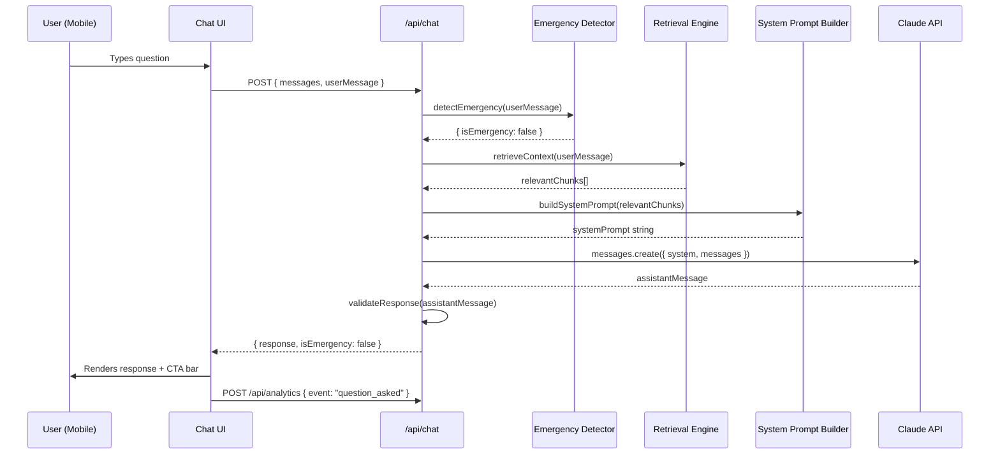
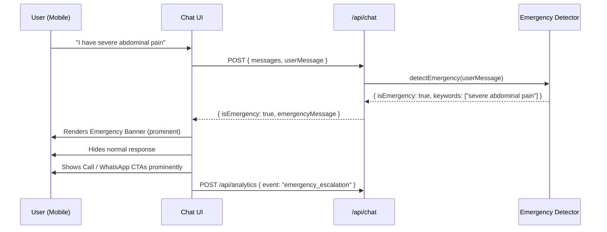
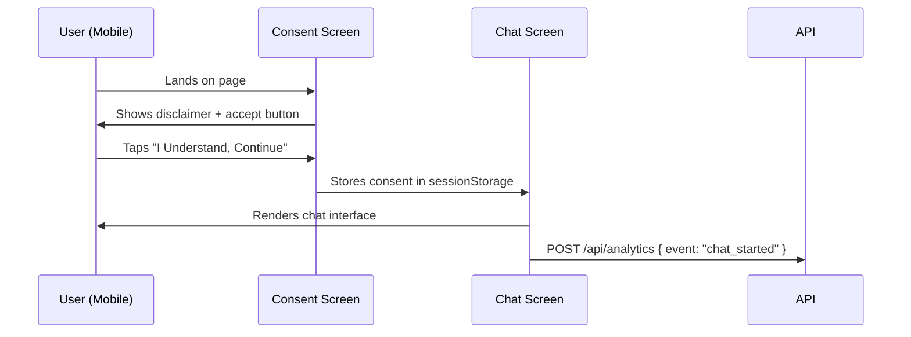

# Design Document: IVF Assistant Chatbot (Dr. Mekhala's Clinic)

## Overview

A mobile-first, web-based IVF education chatbot accessible via any mobile browser — no app install required. The assistant answers IVF-related questions using a curated knowledge base, handles sensitive and emotional topics with empathy, enforces strict medical safety guardrails, and drives every interaction toward a clinic contact action (call, WhatsApp, or booking).

The system is built on Next.js (App Router) with TypeScript and Tailwind CSS, backed by the Anthropic Claude API. A retrieval layer over a markdown knowledge base provides grounded, accurate responses. Emergency keyword detection runs before every model call to intercept crisis situations and surface urgent clinic contact guidance immediately.

The product is designed for lean MVP deployment on Vercel, structured to scale with additional knowledge content, analytics integrations, and future multilingual support.

---

## Architecture

```mermaid
graph TD
    subgraph Client ["Client (Mobile Browser)"]
        A[Consent & Disclaimer Screen]
        B[Chat UI]
        C[CTA Bar — Call / WhatsApp / Book]
        D[Emergency Banner]
    end

    subgraph NextJS ["Next.js App (Vercel)"]
        E[/api/chat Route Handler]
        F[Emergency Keyword Detector]
        G[Retrieval Engine]
        H[System Prompt Builder]
        I[Claude API Client]
        J[Response Validator]
        K[Analytics Event Emitter]
    end

    subgraph External ["External Services"]
        L[Anthropic Claude API]
        M[Clinic Phone — tel link]
        N[Clinic WhatsApp — wa.me]
        O[Booking URL]
    end

    subgraph Storage ["Static Content"]
        P[/content/ivf-faq.md]
        Q[Parsed FAQ Chunks in Memory]
    end

    A -->|User accepts consent| B
    B -->|POST /api/chat| E
    E --> F
    F -->|Emergency detected| D
    F -->|Safe to proceed| G
    G -->|Loads chunks| Q
    Q -->|Sourced from| P
    G -->|Relevant context| H
    H -->|Prompt + context| I
    I -->|Claude SDK call| L
    L -->|Raw response| J
    J -->|Validated response| B
    J --> K
    B --> C
    C --> M
    C --> N
    C --> O
```

---

## Sequence Diagrams

### Normal Chat Flow



### Emergency Escalation Flow



### Consent Flow



---

## Components and Interfaces

### Component 1: ConsentScreen

**Purpose**: Gate the chat behind an explicit disclaimer acceptance. Prevents access to the chatbot without informed consent.

**Interface**:
```typescript
interface ConsentScreenProps {
  onAccept: () => void
}
```

**Responsibilities**:
- Display disclaimer text: "This assistant provides general IVF information, not medical advice"
- Display emergency warning: "Do not use in emergencies — call 999 or your clinic immediately"
- Render a single prominent CTA: "I Understand, Continue"
- Store acceptance in `sessionStorage` under key `ivf_consent_accepted`
- Fire `chat_started` analytics event on acceptance

---

### Component 2: ChatInterface

**Purpose**: Core chat UI. Renders message history, input field, and the persistent CTA bar.

**Interface**:
```typescript
interface ChatInterfaceProps {
  clinicPhone: string
  clinicWhatsApp: string
  bookingUrl: string
}

interface Message {
  id: string
  role: 'user' | 'assistant'
  content: string
  timestamp: Date
  isEmergency?: boolean
}
```

**Responsibilities**:
- Render scrollable message list
- Auto-scroll to latest message
- Render `MessageBubble` for each message
- Render `EmergencyBanner` when `isEmergency: true`
- Render persistent `ClinicCTABar` below every assistant message
- Manage local message state
- Call `/api/chat` on user submission
- Show typing indicator during API call
- Disable input during in-flight request
- Fire `question_asked` analytics event on each submission

---

### Component 3: MessageBubble

**Purpose**: Renders a single chat message with appropriate styling for user vs. assistant.

**Interface**:
```typescript
interface MessageBubbleProps {
  message: Message
  isLatest: boolean
}
```

**Responsibilities**:
- Apply distinct visual styles for `user` vs `assistant` roles
- Render markdown-formatted assistant responses (bold, lists)
- Show timestamp on long-press / hover
- Animate in on mount

---

### Component 4: EmergencyBanner

**Purpose**: Full-width urgent alert shown when emergency keywords are detected.

**Interface**:
```typescript
interface EmergencyBannerProps {
  clinicPhone: string
  clinicWhatsApp: string
}
```

**Responsibilities**:
- Render with high-contrast red/amber background
- Display: "Please contact the clinic immediately or seek emergency care"
- Show prominent Call and WhatsApp buttons
- Appear above the normal response area
- Remain visible until user dismisses or sends a new message

---

### Component 5: ClinicCTABar

**Purpose**: Persistent action bar shown after every assistant response, driving clinic contact.

**Interface**:
```typescript
interface ClinicCTABarProps {
  clinicPhone: string
  clinicWhatsApp: string
  bookingUrl: string
  onCallClick: () => void
  onWhatsAppClick: () => void
  onBookingClick: () => void
}
```

**Responsibilities**:
- Render three action buttons: Call, WhatsApp, Book Consultation
- Use `tel:` link for Call, `https://wa.me/` for WhatsApp, external URL for Booking
- Fire analytics events: `call_clicked`, `whatsapp_clicked`, `booking_clicked`
- Remain accessible (ARIA labels, sufficient tap target size ≥ 44px)

---

### Component 6: ChatInput

**Purpose**: Text input and send button for user messages.

**Interface**:
```typescript
interface ChatInputProps {
  onSubmit: (message: string) => void
  isLoading: boolean
  disabled: boolean
}
```

**Responsibilities**:
- Auto-resize textarea up to 4 lines
- Submit on Enter (mobile: send button tap)
- Disable during in-flight API call
- Clear on successful submission
- Show character limit warning at 500 chars

---

### Component 7: TypingIndicator

**Purpose**: Animated indicator shown while the assistant is generating a response.

**Interface**:
```typescript
interface TypingIndicatorProps {
  visible: boolean
}
```

**Responsibilities**:
- Show three animated dots
- Accessible: `aria-label="Assistant is typing"`
- Auto-hide when response arrives

---

## Data Models

### ChatRequest

```typescript
interface ChatRequest {
  messages: ConversationMessage[]
  userMessage: string
}

interface ConversationMessage {
  role: 'user' | 'assistant'
  content: string
}
```

**Validation Rules**:
- `userMessage` must be non-empty string, max 1000 characters
- `messages` array max length: 20 (sliding window for context)
- Each message `content` must be non-empty string

---

### ChatResponse

```typescript
interface ChatResponse {
  response: string
  isEmergency: boolean
  emergencyMessage?: string
  retrievedChunks?: number  // for debug/logging only
}
```

**Validation Rules**:
- `response` must be non-empty when `isEmergency: false`
- `emergencyMessage` must be present when `isEmergency: true`
- `response` must not contain diagnostic claims, dosage instructions, or lab value interpretations (post-generation validation)

---

### FAQChunk

```typescript
interface FAQChunk {
  id: string
  topic: string
  heading: string
  content: string
  keywords: string[]
}
```

**Validation Rules**:
- `content` must be non-empty
- `keywords` array must have at least one entry
- Loaded once at server startup, cached in module scope

---

### AnalyticsEvent

```typescript
type AnalyticsEventName =
  | 'chat_started'
  | 'question_asked'
  | 'emergency_escalation'
  | 'call_clicked'
  | 'whatsapp_clicked'
  | 'booking_clicked'

interface AnalyticsEvent {
  event: AnalyticsEventName
  timestamp: string  // ISO 8601
  sessionId: string
  metadata?: Record<string, string>
}
```

---

## Algorithmic Pseudocode

### Main Chat Handler Algorithm

```pascal
ALGORITHM handleChatRequest(request: ChatRequest): ChatResponse
INPUT: request containing userMessage and conversation history
OUTPUT: ChatResponse with response text and emergency flag

BEGIN
  ASSERT request.userMessage IS NOT empty
  ASSERT length(request.messages) <= 20

  // Step 1: Emergency detection (runs BEFORE model call)
  emergencyResult ← detectEmergency(request.userMessage)

  IF emergencyResult.isEmergency = true THEN
    emitAnalytics("emergency_escalation")
    RETURN {
      response: "",
      isEmergency: true,
      emergencyMessage: EMERGENCY_GUIDANCE_TEXT
    }
  END IF

  // Step 2: Retrieve relevant knowledge base context
  chunks ← retrieveContext(request.userMessage)

  // Step 3: Build system prompt with retrieved context
  systemPrompt ← buildSystemPrompt(chunks)

  // Step 4: Call Claude API
  rawResponse ← callClaudeAPI(systemPrompt, request.messages, request.userMessage)

  // Step 5: Post-generation safety validation
  validatedResponse ← validateResponse(rawResponse)

  // Step 6: Emit analytics
  emitAnalytics("question_asked")

  RETURN {
    response: validatedResponse,
    isEmergency: false,
    retrievedChunks: length(chunks)
  }
END
```

**Preconditions**:
- `request.userMessage` is non-empty and ≤ 1000 characters
- Claude API key is available in environment
- FAQ chunks are loaded in memory

**Postconditions**:
- If `isEmergency: true`, `emergencyMessage` is always populated
- If `isEmergency: false`, `response` is always a non-empty, validated string
- Analytics event is always emitted

**Loop Invariants**: N/A (no loops in main handler)

---

### Emergency Detection Algorithm

```pascal
ALGORITHM detectEmergency(userMessage: string): EmergencyResult
INPUT: userMessage — raw user input string
OUTPUT: EmergencyResult { isEmergency: boolean, matchedKeywords: string[] }

BEGIN
  normalizedMessage ← toLowerCase(trim(userMessage))
  matchedKeywords ← []

  FOR each keyword IN EMERGENCY_KEYWORDS DO
    IF normalizedMessage CONTAINS keyword THEN
      matchedKeywords.append(keyword)
    END IF
  END FOR

  IF length(matchedKeywords) > 0 THEN
    RETURN { isEmergency: true, matchedKeywords: matchedKeywords }
  ELSE
    RETURN { isEmergency: false, matchedKeywords: [] }
  END IF
END
```

**Emergency Keywords List**:
```pascal
EMERGENCY_KEYWORDS = [
  "severe abdominal pain", "severe pain",
  "heavy bleeding", "bleeding heavily",
  "fainting", "fainted", "passed out",
  "high fever", "fever",
  "breathlessness", "can't breathe", "difficulty breathing",
  "severe vomiting", "vomiting blood",
  "self-harm", "hurt myself", "want to die",
  "suicidal", "end my life",
  "emergency", "ambulance"
]
```

**Preconditions**:
- `userMessage` is a non-null string

**Postconditions**:
- Returns `isEmergency: true` if ANY keyword matches
- Keyword matching is case-insensitive
- Original message is not mutated

**Loop Invariants**:
- All previously checked keywords were not matched when loop continues

---

### Retrieval Algorithm

```pascal
ALGORITHM retrieveContext(userMessage: string): FAQChunk[]
INPUT: userMessage — user's question
OUTPUT: Array of up to MAX_CHUNKS relevant FAQ chunks

BEGIN
  normalizedQuery ← toLowerCase(trim(userMessage))
  queryTokens ← tokenize(normalizedQuery)
  scoredChunks ← []

  FOR each chunk IN FAQ_CHUNKS DO
    score ← 0

    // Keyword overlap scoring
    FOR each keyword IN chunk.keywords DO
      IF normalizedQuery CONTAINS keyword THEN
        score ← score + KEYWORD_MATCH_WEIGHT
      END IF
    END FOR

    // Token overlap scoring
    FOR each token IN queryTokens DO
      IF toLowerCase(chunk.content) CONTAINS token AND length(token) > 3 THEN
        score ← score + TOKEN_MATCH_WEIGHT
      END IF
    END FOR

    IF score > 0 THEN
      scoredChunks.append({ chunk: chunk, score: score })
    END IF
  END FOR

  // Sort by score descending
  sortedChunks ← sortByScore(scoredChunks, descending)

  // Return top N chunks
  RETURN map(take(sortedChunks, MAX_CHUNKS), c => c.chunk)
END
```

**Constants**:
```pascal
MAX_CHUNKS = 3
KEYWORD_MATCH_WEIGHT = 2
TOKEN_MATCH_WEIGHT = 1
```

**Preconditions**:
- `FAQ_CHUNKS` is loaded and non-empty
- `userMessage` is non-empty

**Postconditions**:
- Returns 0 to MAX_CHUNKS chunks
- Returned chunks are ordered by relevance score (highest first)
- If no chunks match, returns empty array (fallback handled in system prompt builder)

**Loop Invariants**:
- All previously scored chunks have valid scores ≥ 0

---

### System Prompt Builder Algorithm

```pascal
ALGORITHM buildSystemPrompt(chunks: FAQChunk[]): string
INPUT: chunks — retrieved FAQ chunks (may be empty)
OUTPUT: Complete system prompt string for Claude

BEGIN
  basePrompt ← SYSTEM_PROMPT_BASE

  IF length(chunks) > 0 THEN
    contextSection ← "RELEVANT KNOWLEDGE BASE CONTEXT:\n"
    FOR each chunk IN chunks DO
      contextSection ← contextSection + "---\n"
      contextSection ← contextSection + "Topic: " + chunk.topic + "\n"
      contextSection ← contextSection + chunk.content + "\n"
    END FOR
    RETURN basePrompt + "\n\n" + contextSection
  ELSE
    fallbackNote ← "No specific knowledge base content matched this query. "
                 + "Respond cautiously with general IVF education only, "
                 + "and recommend the user contact the clinic for specifics."
    RETURN basePrompt + "\n\n" + fallbackNote
  END IF
END
```

**System Prompt Base (SYSTEM_PROMPT_BASE)**:
```
You are a compassionate IVF education assistant for Dr. Mekhala's fertility clinic.

YOUR ROLE:
- Provide general IVF education and information only
- Answer questions about IVF processes, timelines, procedures, and emotional aspects
- Support users who are anxious, grieving, or emotionally vulnerable

YOU MUST NEVER:
- Diagnose any medical condition
- Prescribe or recommend medications or dosages
- Interpret lab results (AMH, beta-hCG, semen analysis, embryo grades, scan results)
- Guarantee pregnancy outcomes or success rates
- Make definitive medical claims

YOU MUST ALWAYS:
- Acknowledge the user's concern with warmth and empathy
- Provide a clear, simple explanation
- State your limitations honestly when relevant
- Encourage consulting Dr. Mekhala for personalized advice
- End every response by reminding the user they can call, WhatsApp, or book a consultation

TONE: Warm, calm, reassuring, non-judgmental, emotionally supportive.

RESPONSE STRUCTURE:
1. Acknowledge the user's concern
2. Provide clear, simple information
3. State any relevant limitations
4. Encourage clinic contact for personalized advice
```

---

### Response Validation Algorithm

```pascal
ALGORITHM validateResponse(rawResponse: string): string
INPUT: rawResponse — raw text from Claude API
OUTPUT: Safe, validated response string

BEGIN
  ASSERT rawResponse IS NOT empty

  // Check for forbidden patterns
  FOR each pattern IN FORBIDDEN_PATTERNS DO
    IF rawResponse MATCHES pattern THEN
      // Replace with safe fallback
      rawResponse ← SAFE_FALLBACK_RESPONSE
      LOG warning: "Forbidden pattern detected: " + pattern
      BREAK
    END IF
  END FOR

  // Ensure response is not excessively long
  IF length(rawResponse) > MAX_RESPONSE_LENGTH THEN
    rawResponse ← truncateAtSentenceBoundary(rawResponse, MAX_RESPONSE_LENGTH)
  END IF

  RETURN rawResponse
END
```

**Forbidden Patterns**:
```pascal
FORBIDDEN_PATTERNS = [
  /take \d+mg/i,           // dosage instructions
  /your AMH (is|means|indicates)/i,  // lab interpretation
  /your beta.?hCG/i,
  /you (have|are diagnosed with)/i,  // diagnosis
  /you (should|must) (take|stop|increase|decrease)/i  // prescriptions
]

MAX_RESPONSE_LENGTH = 1500  // characters
```

---

## Key Functions with Formal Specifications

### `detectEmergency(userMessage: string): EmergencyResult`

**Preconditions**:
- `userMessage` is a defined, non-null string

**Postconditions**:
- `result.isEmergency === true` if and only if at least one emergency keyword is found (case-insensitive)
- `result.matchedKeywords` contains all matched keywords
- `userMessage` is not mutated

---

### `retrieveContext(userMessage: string): FAQChunk[]`

**Preconditions**:
- `FAQ_CHUNKS` module-level array is loaded and non-empty
- `userMessage` is non-empty

**Postconditions**:
- Returns array of length 0 to `MAX_CHUNKS`
- Chunks are ordered by descending relevance score
- No chunk appears more than once in the result

---

### `buildSystemPrompt(chunks: FAQChunk[]): string`

**Preconditions**:
- `SYSTEM_PROMPT_BASE` constant is defined and non-empty

**Postconditions**:
- Returns non-empty string
- If `chunks.length > 0`, returned string contains all chunk content
- If `chunks.length === 0`, returned string contains fallback instruction

---

### `validateResponse(rawResponse: string): string`

**Preconditions**:
- `rawResponse` is a non-empty string

**Postconditions**:
- Returned string contains no forbidden patterns
- Returned string length ≤ `MAX_RESPONSE_LENGTH`
- If forbidden pattern found, returns `SAFE_FALLBACK_RESPONSE` (not empty)

---

### `parseFAQMarkdown(markdownContent: string): FAQChunk[]`

**Preconditions**:
- `markdownContent` is a non-empty string
- Content follows the expected heading structure (`## Topic`, `### Heading`)

**Postconditions**:
- Returns array of `FAQChunk` objects
- Each chunk has non-empty `id`, `topic`, `heading`, `content`
- Keywords are extracted from heading words (lowercase, stop-words removed)
- No two chunks share the same `id`

---

## Example Usage

```typescript
// 1. Normal question flow
const request: ChatRequest = {
  userMessage: "What happens during egg retrieval?",
  messages: [
    { role: "user", content: "What is IVF?" },
    { role: "assistant", content: "IVF stands for In Vitro Fertilisation..." }
  ]
}

const response = await handleChatRequest(request)
// response.isEmergency === false
// response.response === "Egg retrieval, also called egg pickup..."

// 2. Emergency detection
const emergencyRequest: ChatRequest = {
  userMessage: "I have severe abdominal pain and I'm fainting",
  messages: []
}

const emergencyResponse = await handleChatRequest(emergencyRequest)
// emergencyResponse.isEmergency === true
// emergencyResponse.emergencyMessage === "Please contact the clinic immediately..."

// 3. No knowledge base match
const unknownRequest: ChatRequest = {
  userMessage: "What is the best restaurant near the clinic?",
  messages: []
}

const unknownResponse = await handleChatRequest(unknownRequest)
// retrieveContext returns []
// Claude responds cautiously, recommends contacting clinic

// 4. Retrieval
const chunks = retrieveContext("PCOS and IVF success rates")
// chunks[0].topic === "PCOS"
// chunks[0].score is highest among all chunks
```

---

## Correctness Properties

1. **Emergency-first guarantee**: For any user message containing an emergency keyword, `isEmergency` is always `true` and the model is never called.

2. **No diagnosis property**: For any validated response `r`, `r` does not match any pattern in `FORBIDDEN_PATTERNS`.

3. **CTA presence**: For every assistant message rendered in the UI, the `ClinicCTABar` is rendered immediately below it.

4. **Consent gate**: The chat interface is never rendered unless `sessionStorage.getItem('ivf_consent_accepted') === 'true'`.

5. **Retrieval boundedness**: `retrieveContext` always returns at most `MAX_CHUNKS` chunks regardless of input.

6. **Response non-emptiness**: For any non-emergency response, `response.length > 0`.

7. **Analytics completeness**: Every `chat_started`, `question_asked`, `emergency_escalation`, `call_clicked`, `whatsapp_clicked`, and `booking_clicked` action fires exactly one analytics event.

---

## Error Handling

### Error Scenario 1: Claude API Failure

**Condition**: Anthropic API returns a non-2xx response or network timeout
**Response**: Return HTTP 503 with `{ error: "Service temporarily unavailable" }`
**Recovery**: UI shows: "I'm having trouble responding right now. Please contact the clinic directly." + prominent CTA bar
**Retry**: No automatic retry on the client; user can re-submit

---

### Error Scenario 2: FAQ File Not Found

**Condition**: `/content/ivf-faq.md` is missing at startup
**Response**: Server logs error, continues with empty chunk array
**Recovery**: All requests use fallback system prompt; responses remain safe but less grounded

---

### Error Scenario 3: Response Validation Failure

**Condition**: Claude response matches a forbidden pattern
**Response**: Replace with `SAFE_FALLBACK_RESPONSE`; log warning with pattern matched
**Recovery**: User receives safe fallback; no unsafe content is surfaced

---

### Error Scenario 4: Oversized User Input

**Condition**: `userMessage.length > 1000`
**Response**: Return HTTP 400 with `{ error: "Message too long" }`
**Recovery**: UI shows inline validation error; user can shorten their message

---

### Error Scenario 5: Analytics Failure

**Condition**: Analytics event emission fails (network error, etc.)
**Response**: Log silently; do not surface to user
**Recovery**: Chat continues normally; analytics gap is acceptable

---

## Testing Strategy

### Unit Testing Approach

Test each pure function in isolation:
- `detectEmergency`: all keyword variants, case insensitivity, no false positives on safe messages
- `retrieveContext`: scoring logic, MAX_CHUNKS cap, empty result on no match
- `buildSystemPrompt`: with chunks, without chunks, correct concatenation
- `validateResponse`: each forbidden pattern, length truncation, safe passthrough
- `parseFAQMarkdown`: valid markdown, missing headings, empty content

**Framework**: Jest + ts-jest

---

### Property-Based Testing Approach

**Property Test Library**: fast-check

Key properties to test:
- `detectEmergency(msg)` where `msg` contains no emergency keywords → always returns `isEmergency: false`
- `retrieveContext(msg)` → always returns array of length ≤ `MAX_CHUNKS`
- `validateResponse(r)` → returned string never matches any forbidden pattern
- `parseFAQMarkdown(md)` → all returned chunks have non-empty `id`, `topic`, `content`

---

### Integration Testing Approach

- POST `/api/chat` with emergency message → verify `isEmergency: true`, no Claude call made
- POST `/api/chat` with normal IVF question → verify valid response, `isEmergency: false`
- POST `/api/chat` with oversized message → verify HTTP 400
- POST `/api/chat` with empty message → verify HTTP 400
- Consent screen → verify chat is blocked without `sessionStorage` flag

---

## Performance Considerations

- FAQ markdown is parsed once at module load time (not per-request) and cached in memory
- Retrieval is O(n × k) where n = number of chunks and k = number of query tokens — acceptable for a small knowledge base (< 500 chunks)
- Claude API streaming is not used in MVP; full response is awaited (target: < 5s p95)
- Next.js static assets are served via Vercel CDN; initial page load target: < 2s on 4G
- Conversation history is capped at 20 messages to bound token usage per request
- No database; all state is client-side (sessionStorage for consent, React state for messages)

---

## Security Considerations

- `ANTHROPIC_API_KEY` is server-side only; never exposed to the client
- All environment variables (`CLINIC_PHONE`, `CLINIC_WHATSAPP`, `BOOKING_URL`) are read server-side and injected as Next.js public env vars only for non-sensitive values
- User messages are not persisted; no PII is stored
- Input length validation (1000 char max) prevents prompt injection via oversized payloads
- System prompt is constructed server-side; client cannot override it
- Rate limiting should be applied at the Vercel edge or via middleware (post-MVP)
- No authentication required for MVP (public chatbot)

---

## Dependencies

| Package | Version | Purpose |
|---|---|---|
| `next` | 14.x | App Router framework |
| `react` | 18.x | UI library |
| `typescript` | 5.x | Type safety |
| `tailwindcss` | 3.x | Utility-first CSS |
| `@anthropic-ai/sdk` | 0.20.x | Claude API client |
| `gray-matter` | 4.x | Markdown frontmatter parsing |
| `jest` | 29.x | Unit test runner |
| `ts-jest` | 29.x | TypeScript Jest transformer |
| `fast-check` | 3.x | Property-based testing |

**Environment Variables**:
```
ANTHROPIC_API_KEY=          # Server-side only
CLAUDE_MODEL=               # e.g. claude-3-5-sonnet-20241022
NEXT_PUBLIC_CLINIC_PHONE=   # tel: link value
NEXT_PUBLIC_CLINIC_WHATSAPP= # wa.me number
NEXT_PUBLIC_BOOKING_URL=    # Booking page URL
```
